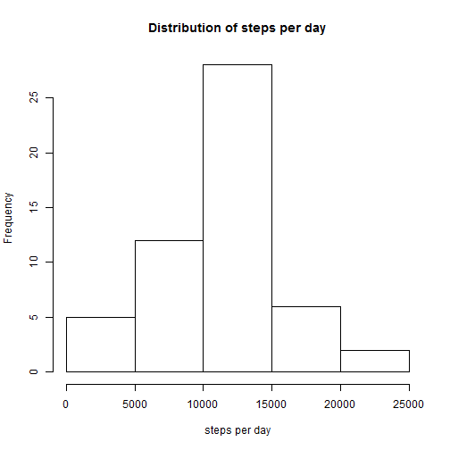
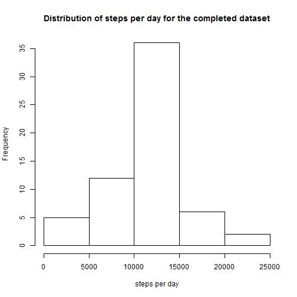

The activity monitoring data in the file activity.zip has 3 columns:

- steps: number of steps in a 5-minute interval
- date: date on which the measurement was taken
- interval: identifier for the 5-minute interval (i.e. starting time of interval)

The head of the dataset is shown below.

```
##   steps       date interval
## 1    NA 2012-10-01        0
## 2    NA 2012-10-01        5
## 3    NA 2012-10-01       10
## 4    NA 2012-10-01       15
## 5    NA 2012-10-01       20
## 6    NA 2012-10-01       25
```

Below the distribution of the total number of steps per day is shown in a histogram

 

The mean number of steps per day   : 10766  
The median number of steps per day : 10765

Below a timeplot is given for the average steps per interval over the days in the dataset

 

The interval with on average the maximum number of steps is 835


In the dataset, there are 2304 rows which are incomplete

To complete the dataset, the average number of steps for the interval is used


Below the distribution of the total number of steps per day for the completed dataset is shown in a histogram

 

The mean number of steps per day for the completed dataset   : 10766  
The median number of steps per day for the completed dataset : 10765

The mean and median are not changed.
Completing the dataset with the current distribution per day has no effect on the estimates per day. The distribution of the steps per day is changed as the added data results in additional days with the mean number of steps, making the distribution of steps per day narrower.

 
